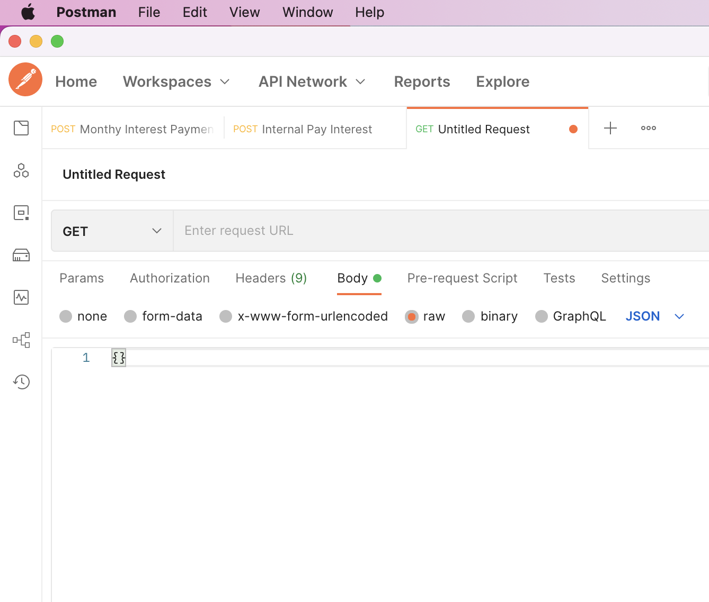

# Monitor File System

This application was developed for checking changes of a Smart Contract file and then dump it into the appropriate format to be put in JSON payload by pasting.

## Installation guide
Note: make sure you have `pip` and `virtualenv` installed.

    python3 -m venv venv
    source venv/bin/activate
    pip install -r requirements.txt

## Run program
    python3 main.py

## Using instruction
In the `config.py` file, there are 2 configurations which are the path of Smart Contract file and the flag for checking changes. Any time you make changes, the program will capture all the these changes, process the code file and send the content to clipboard. Conversely, no data of code will be stored in clipboard!

If you don't want to track the file change, simply toggle `USE_FILE_TRACKER` to False but you will have to re-run the application whenever the Smart Contract file changes.

### Before running code

### After running code and pasting
The Smart Contract code is in clipboard now, just simply paste it into Postman.
